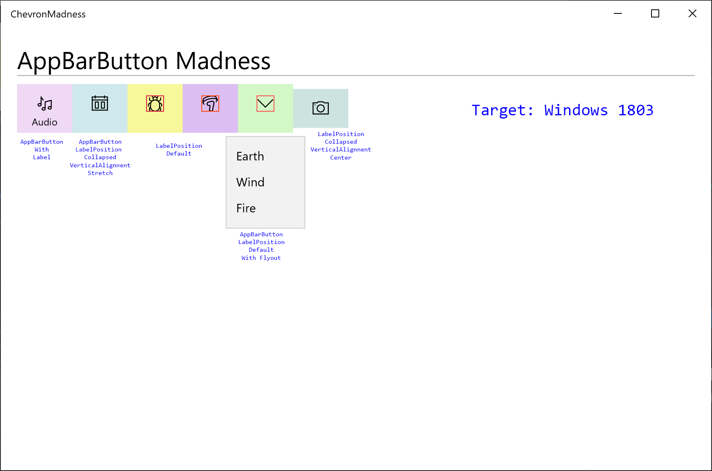

# UWP AppBarButton Madness
Sample project demonstrating issues with AppBarButton when targeting 1809

An existing project that targeted 1803 with AppBarButtons, specifically ones with a Flyout, appear as expected. Even though it doesn't add a chevron, it is still puzzling why when stretched vertically and the LabelPosition is collapsed, why the icon doesn't move to the vertical center, or a way to control that isn't given. Notice the far right icon with LabelPosition collapsed and VerticalAlignment is not set to stretch, but rather to center. In that situation the icon is vertically centered, but button height is a bit of an issue as the icon won't stay centered.

Once the target is updated to 1809, the AppBarButtons with Flyouts get a new right chevron icon and the glyph gets shoved to the left. 

If you try to style this button to remove the chevron, downlevel versions of Windows 10 (1703,1709, etc.) suffer from XAML parsing exceptions. See this stackoverflow post for a proposed style which will cause issues with older versions. [STACKOVERFLOW - remove chevron](https://stackoverflow.com/questions/55038971/remove-the-chevron-arrow-added-to-the-appbarbutton-when-a-flyout-is-attached)

## Prognosis
It is unlikely that this can be fixed as the default styles shipped with 1809 are pretty well fixed. The only solution that seems plausible is to create a OS independent equivalent of the AppBarButton through WinUI that will work across the supported versions of Windows 10.